# Perseus 1 Mission Control — Ascent Screenshots

Screenshots captured from the real-time Mission Control web UI running in
simulation mode. The UI provides NASA-style flight director displays with
live telemetry, go/no-go gates, trajectory visualization, and advisory
alerts throughout the ascent to orbit.

---

## Pre-Launch

### Launch Checklist Overlay
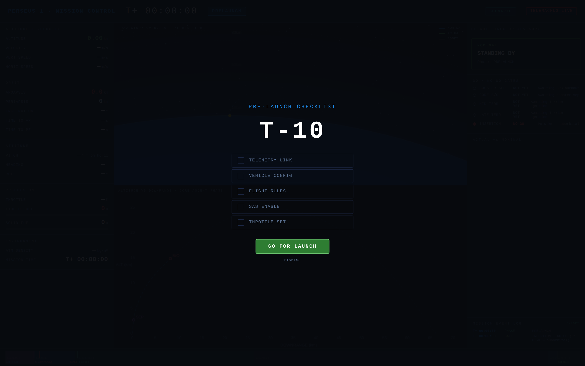

The pre-launch checklist overlay appears on startup. Flight controllers
verify telemetry link, vehicle config, flight rules, SAS, and throttle
before pressing **GO FOR LAUNCH**.

### Pad Ready — All Systems Nominal
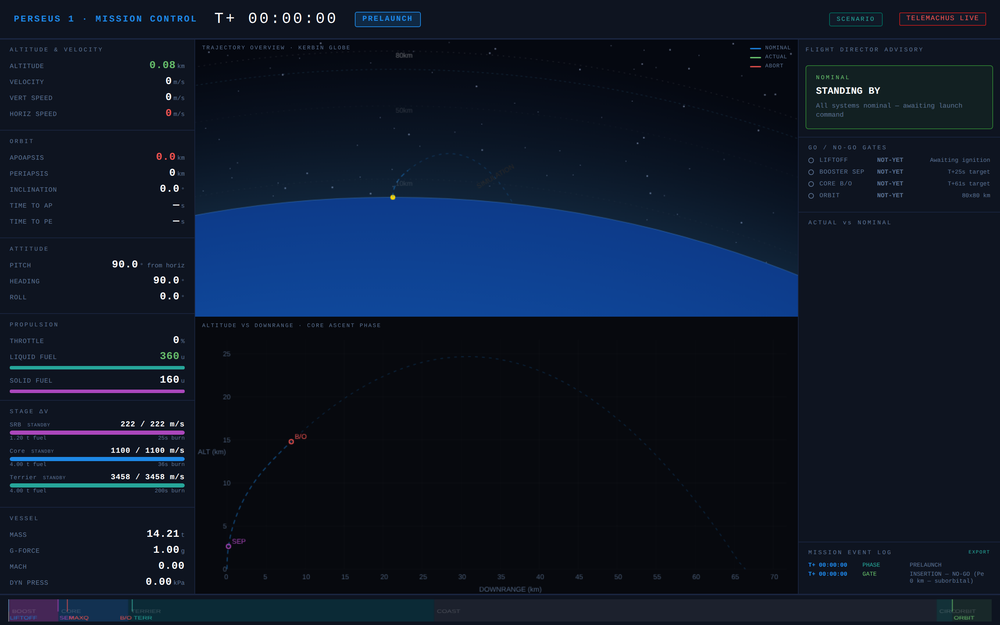

On the pad with all systems nominal. The three-panel layout shows:
- **Left:** Full telemetry readout — altitude, velocity, orbit params, attitude, propulsion, stage dV bars, and vessel data
- **Center top:** Kerbin globe with nominal trajectory (dashed blue) and 80 km orbit ring
- **Center bottom:** Altitude vs downrange plot with nominal profile and atmospheric boundary
- **Right:** Flight Director Advisory panel with go/no-go gates and actual-vs-nominal comparison

---

## Boost Phase

### T+10s — SRBs Burning
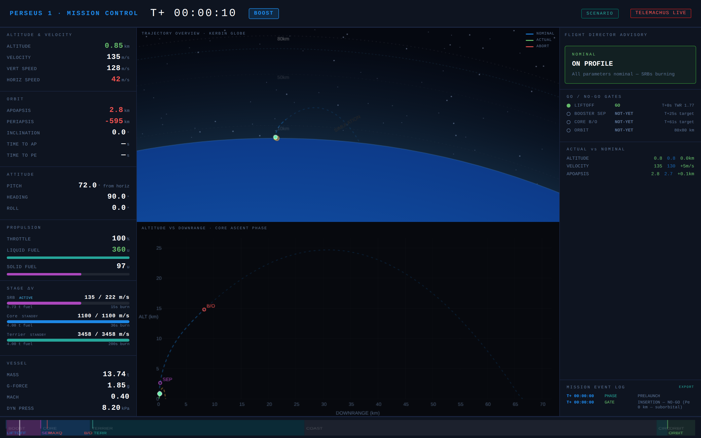

Ten seconds into flight. The twin Hammer SRBs are burning at 20% thrust
(135 of 222 m/s dV remaining). The vehicle is at 0.85 km altitude, Mach 0.40,
with the gravity turn just beginning. The phase badge shows **BOOST** and
LIFTOFF gate is **GO**. Stage dV bars show all three stages with SRB active.

### T+25s — Booster Separation
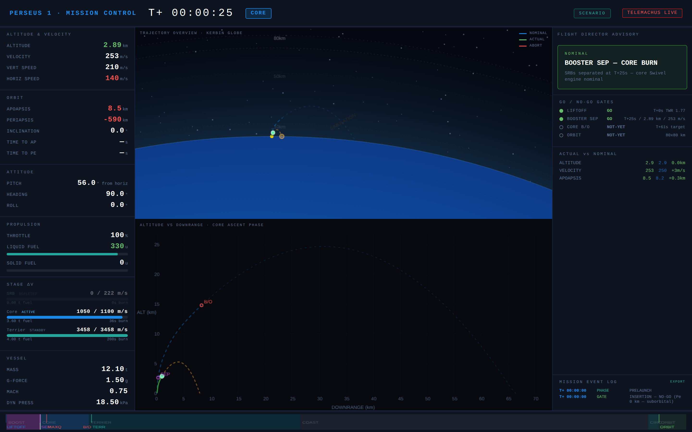

Booster separation at T+25s, 2.89 km altitude, 253 m/s. The SRB stage shows
**DEPLETED** with 0/222 m/s remaining. The Core Swivel engine is now the active
stage. Both LIFTOFF and BOOSTER SEP gates are **GO**. The trajectory plot shows
the vehicle tracking the nominal ascent profile.

---

## Core Stage

### T+40s — Supersonic, Gravity Turn
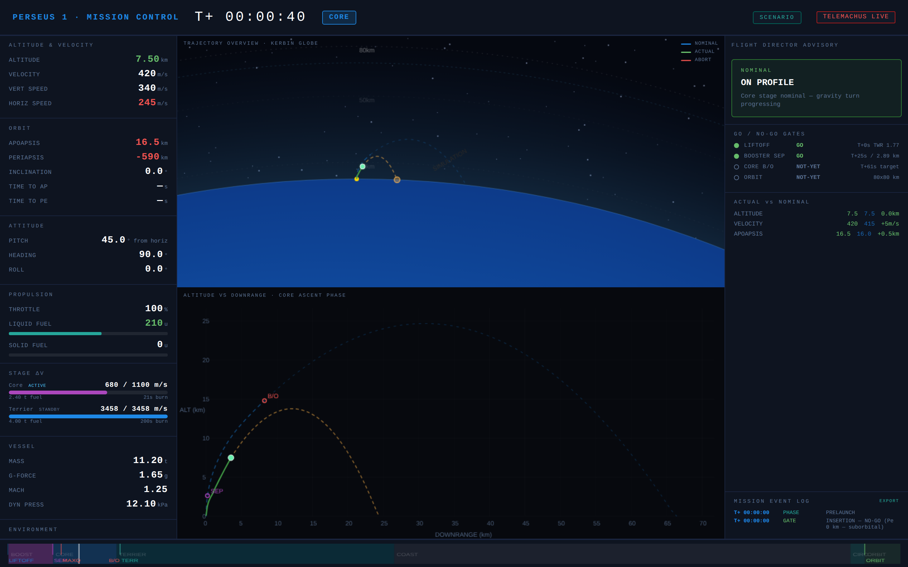

Mid-core-burn at T+40s. The vehicle is supersonic (Mach 1.25) at 7.5 km, pitched
45 degrees from horizontal. Apoapsis is 16.5 km and climbing. Dynamic pressure
reads 12.1 kPa near max-Q. The core stage has 680/1100 m/s dV remaining.

### T+61s — Core Burnout and Staging
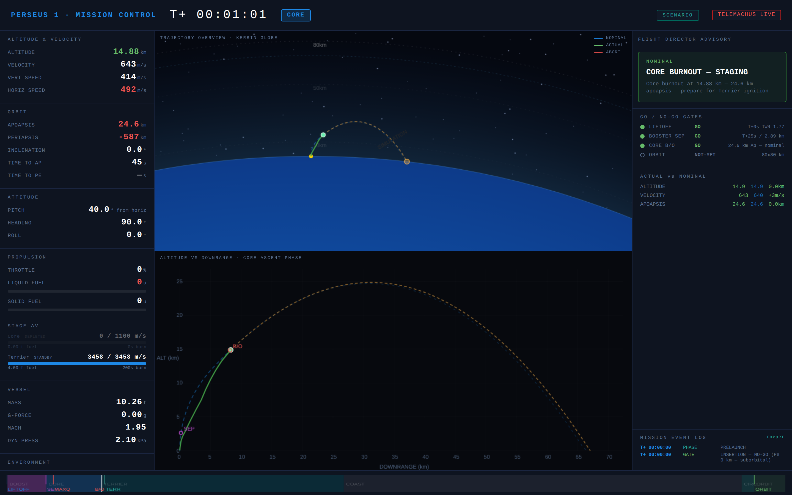

Core burnout at T+61s. All verified numbers match the simulation: 14.88 km
altitude, 643 m/s velocity, 24.6 km apoapsis. The CORE B/O gate turns **GO**.
Throttle drops to 0% as the vehicle coasts briefly before Terrier ignition.
G-force reads 0.00 during the staging coast.

---

## Terrier Upper Stage

### T+80s — Terrier Burn, Above Atmosphere
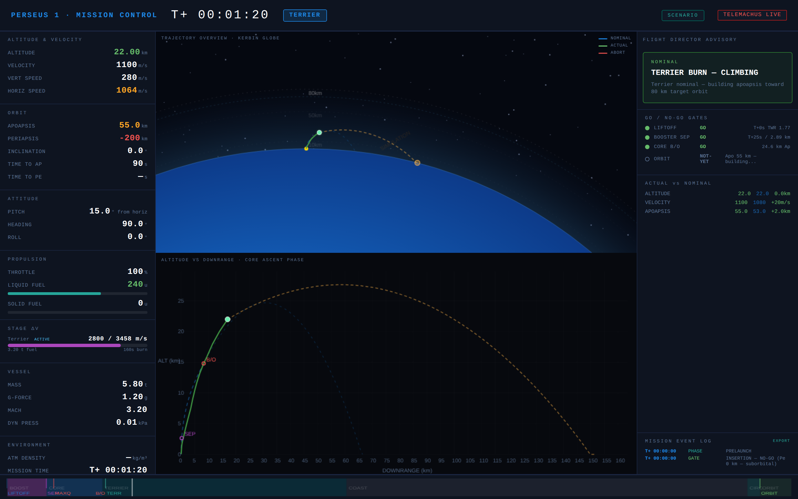

The Terrier engine is burning above the atmosphere at 22 km. Velocity has
climbed to 1,100 m/s with the horizontal component (1,064 m/s) now dominating
as the vehicle pitches nearly horizontal. Apoapsis is 55 km — halfway to the
80 km target. The globe view shows the trajectory arcing along Kerbin's surface
with the ballistic projection (orange dashed line) extending ahead.

### T+120s — Circularization
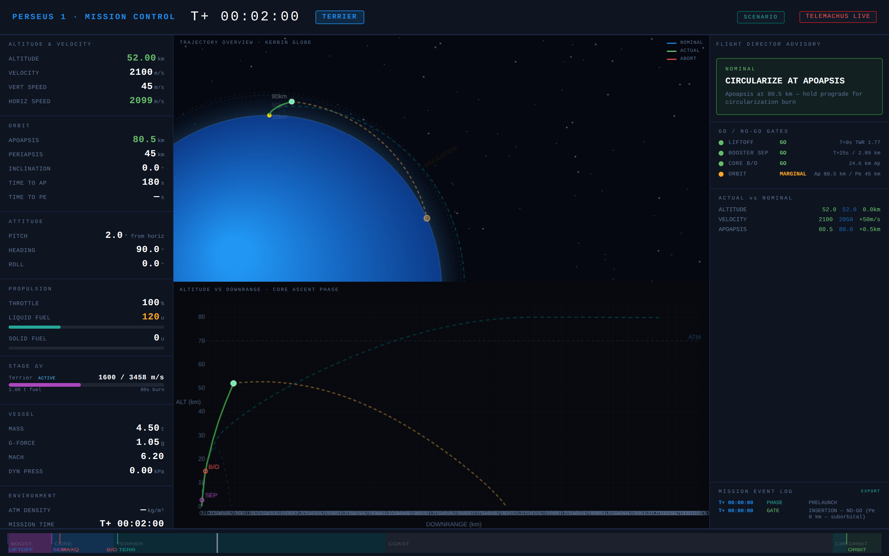

Approaching orbit at T+120s. Apoapsis has reached 80.5 km (target achieved)
and periapsis is climbing through 45 km. The vehicle is nearly horizontal at
2 degrees pitch, burning to raise periapsis. The ORBIT gate shows **MARGINAL**
— periapsis still needs to come up for a stable circular orbit.

---

## Orbit

### T+160s — Orbit Achieved, All Gates GO
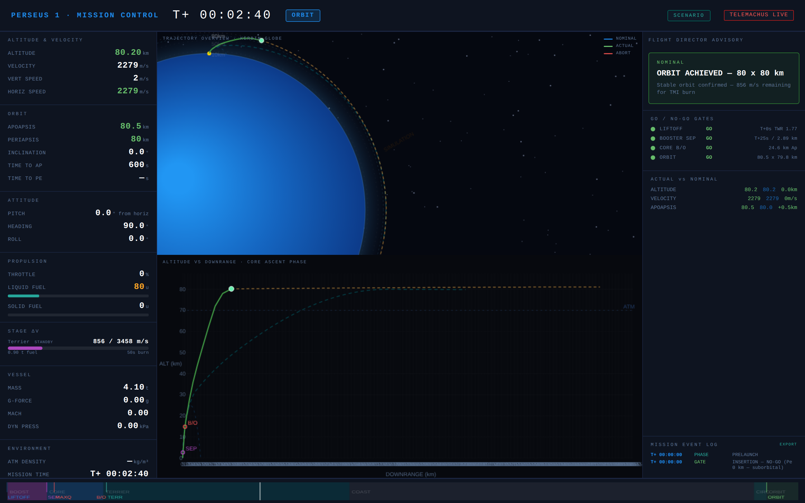

Stable 80.5 x 79.8 km orbit confirmed at T+2:40. All four go/no-go gates
are **GO** (green). The advisory reads **ORBIT ACHIEVED — 80 x 80 km** with
856 m/s dV remaining in the Terrier for the Trans-Munar Injection burn.
The globe view shows the full orbital trajectory wrapping around Kerbin.
The altitude plot shows the trajectory leveling off at 80 km above the
atmosphere ceiling (dashed ATM line at ~70 km).

---

## Advisory System

### CAUTION — Steep Pitch
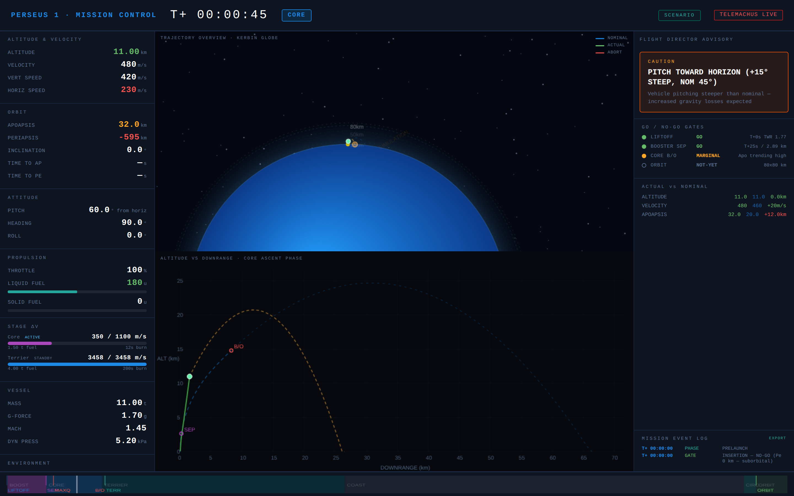

The Flight Director Advisory box turns **yellow** for a CAUTION-level alert.
The vehicle is pitching 15 degrees steeper than nominal at T+45s during the
core burn, with apoapsis trending 12 km above nominal (32 km vs 20 km
expected). The advisory recommends pitching toward the horizon. The CORE B/O
gate shows **MARGINAL** (yellow indicator).

### WARNING — Low Apoapsis
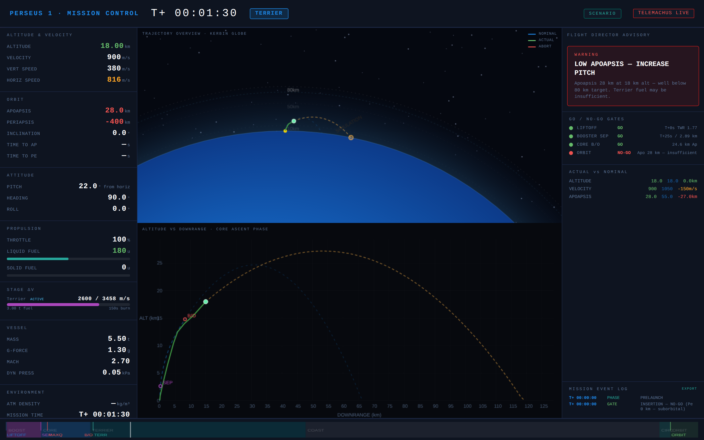

A **red** WARNING-level alert. At T+90s the Terrier is burning but apoapsis
is only 28 km — well below the 80 km target (27 km behind nominal). Velocity
is 150 m/s below what it should be. The ORBIT gate shows **NO-GO** (red
indicator) with the detail "Apo 28 km — insufficient." The advisory warns
that Terrier fuel may be insufficient to reach orbit.

---

## Scenario System

### Scenario Selection Panel
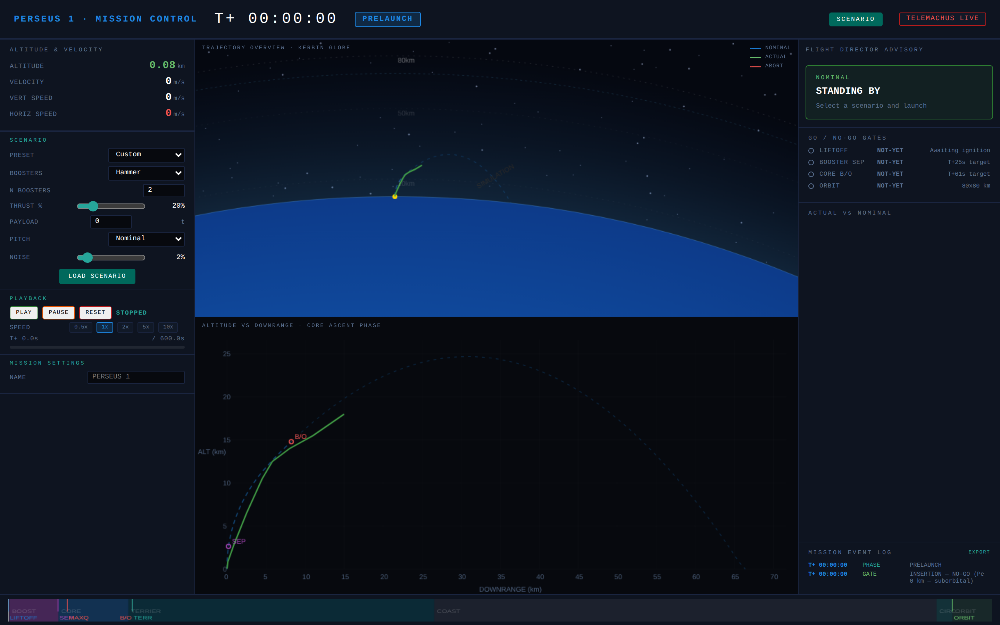

The scenario panel (accessed via the **SCENARIO** button in the top bar)
allows loading different vehicle configurations and pitch programs for
what-if analysis. Custom parameters include booster type (Hammer/Thumper),
count, thrust percentage, extra payload mass, pitch program, and telemetry
noise. Playback controls (PLAY / PAUSE / RESET) with variable speed
(0.5×–10×) let you scrub through simulated ascents. Preset scenarios
include nominal, steep/shallow/late pitch programs, heavy payload,
Thumper booster variants, high-TWR configs, and abort training scenarios.
